# InstaSub

# **Welcome to [InstaSub](https://instasub.herokuapp.com)! Where to go when you need a Sub lesson quick!**

 

---

 

## **Just create an account to get started!**

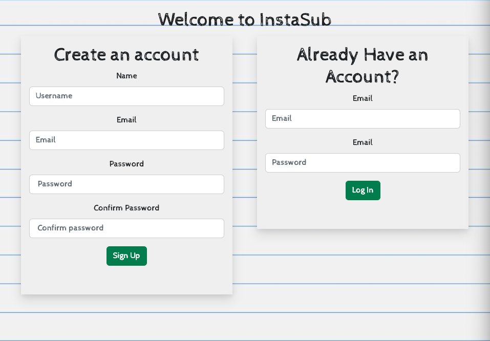

 

---

 

## **Your on your way to creating a new sub plan! Just use the buttons to put together the missing pieces!**

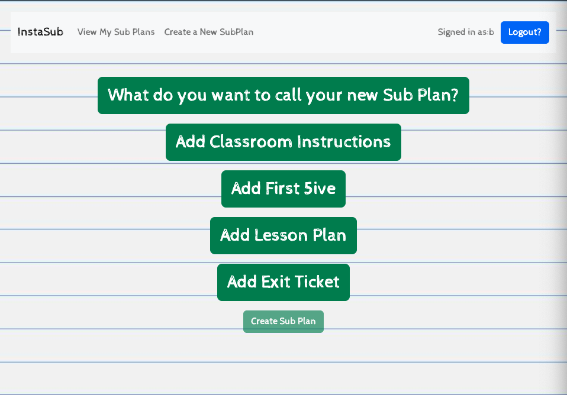

 

---

 

## **What do you want to call your new sub plan?**

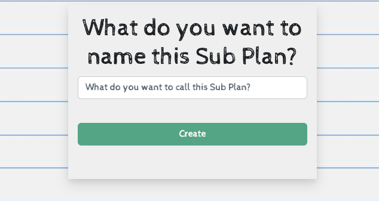

 

---

 

## **Simply click create and it's added to the other pieces of your lesson!**

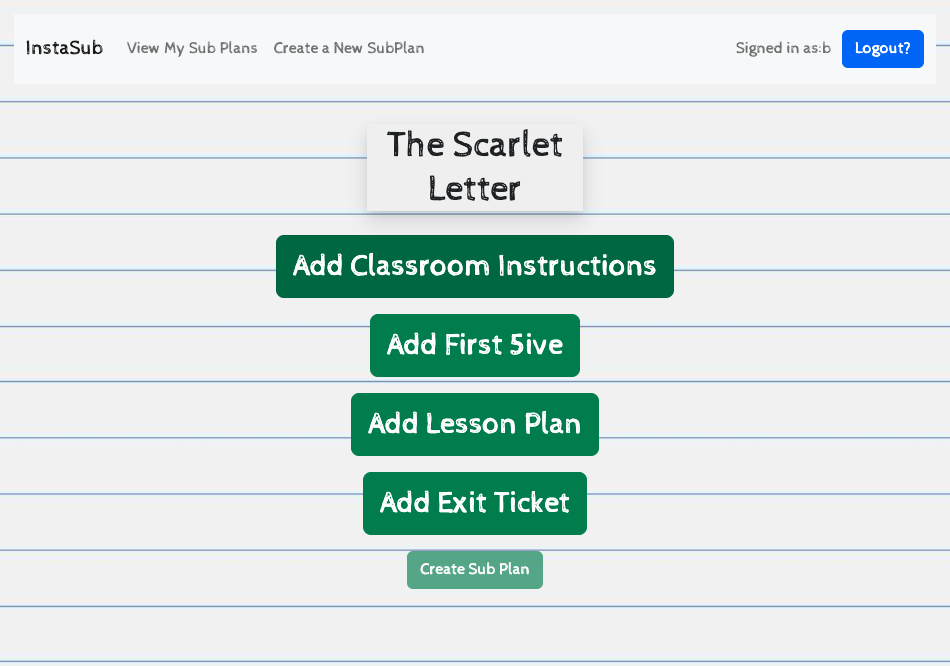

 

---

 

## **Now lets add some classroom instructions and content: You can always add a new set of classroom instructions. But since but since most won't change, so you can always just click to add the ones from former sub plans! Just click on the card to add**

 

---

 

## **Better double check to make sure it's the right one first! Make any changes you need, then update and add!**

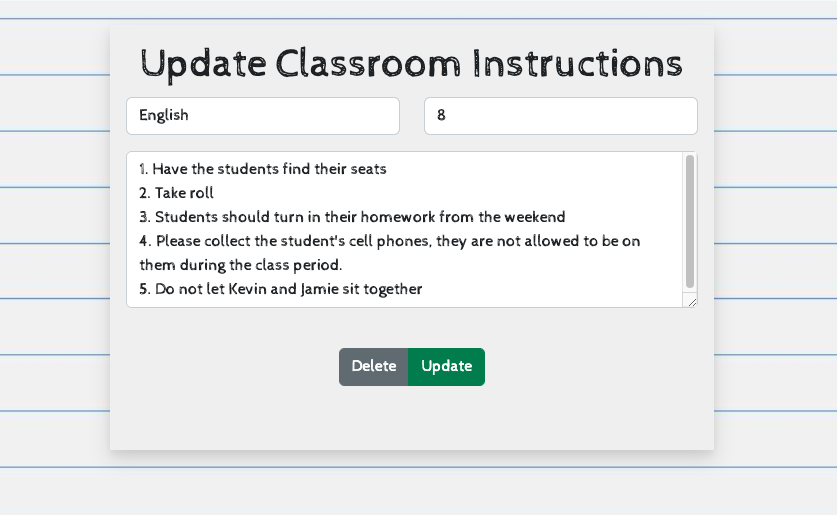

 

---

 

## **Now it's time to add some prompts and reviews! Studies show that students learn better when they're primed for the classroom setting with a quick prompt to prepare for today's lesson or review what was just learned, So lets make sure we add a First Five (minutes) to start the day, and an Exit Ticket to close it out!**

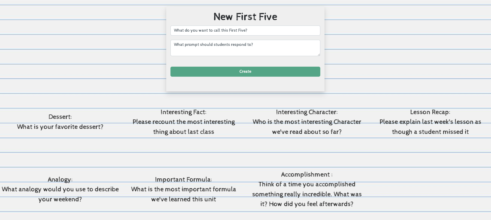

 

---

 

## **These are generic and highly reusable!**

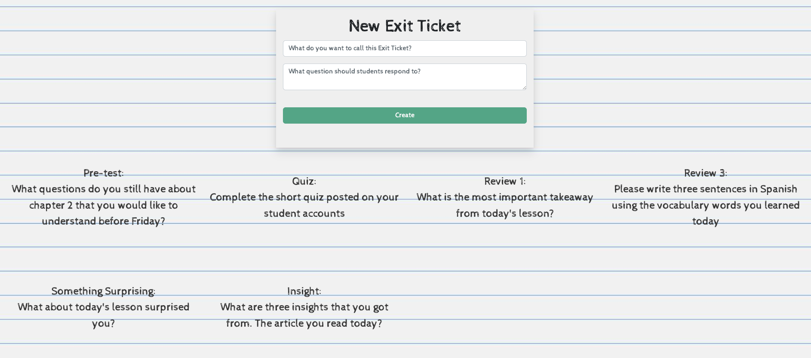

 

---

 

## **Now that your plan is in place, click create and it's ready to go!**

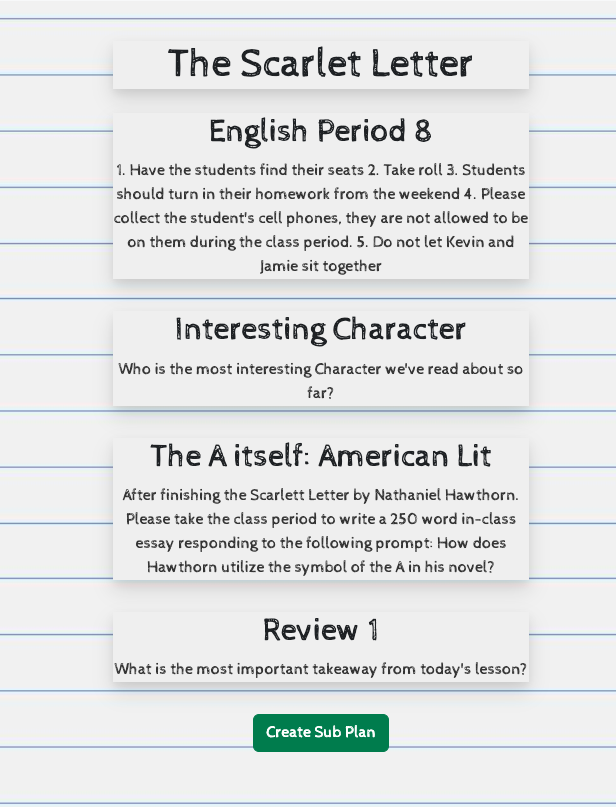

 

---

 

## **You can view all your sub plans in one place!**

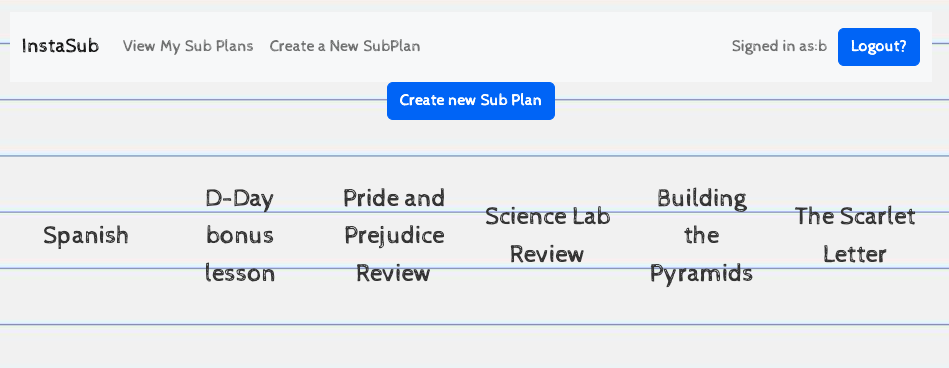

 

---

 

## **You can use the plan you just created OR one you used in the past!**

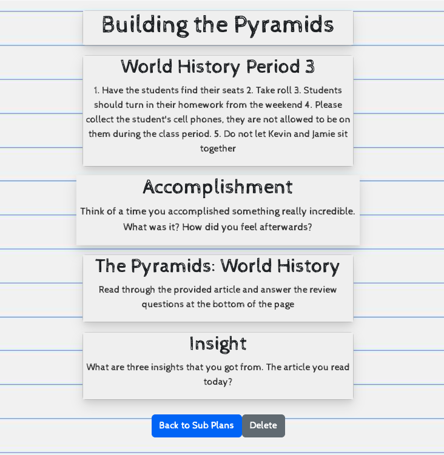

 

---

 

## **With coursetracker it's easy! Just point and click!**

## **Come visit: https://instasub.herokuapp.com**

 

---

 

# Technologies Used:

React, Mongoose, Express, MongoDB (as well as MongoDB Cloud), JavaScript, CSS, React Bootstrap, Heroku

# Where it started:

React Tree

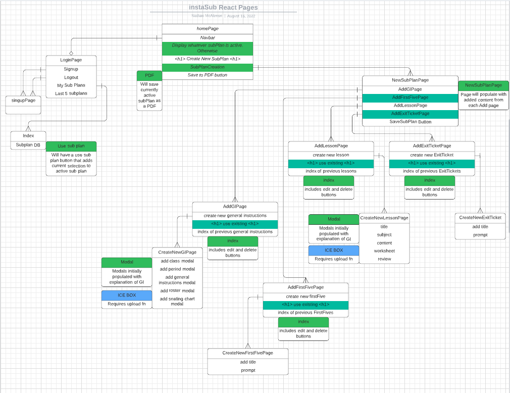

ERD

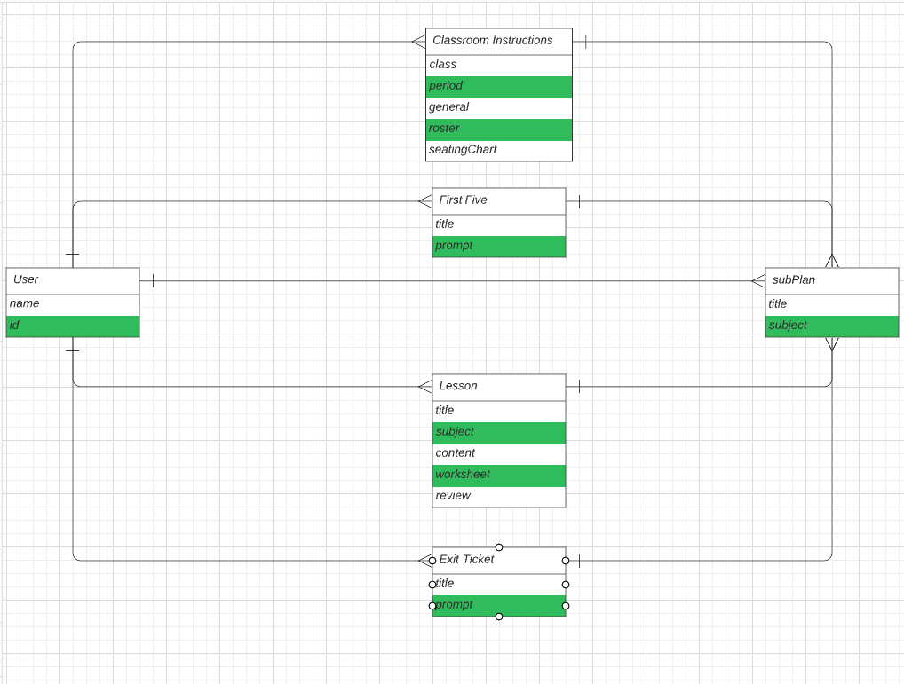

Trello

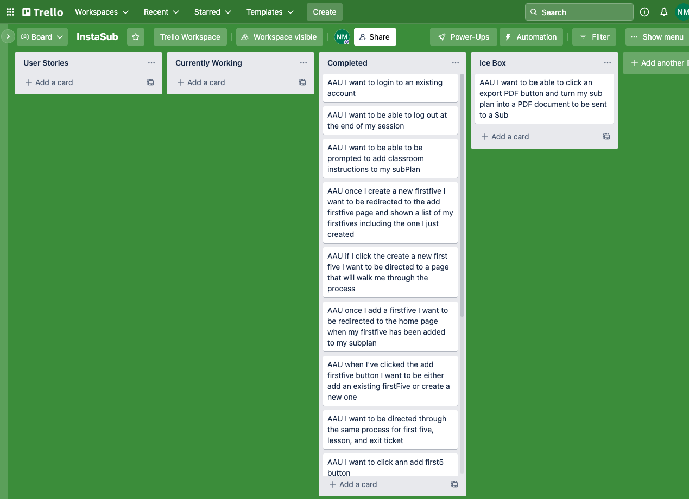

# Next Steps:

ICE BOX:

- Develop PDF export functionality once a sub plan has been chosen
- Integrate google Drive to upload worksheets and seating charts
- Expand app to include curriculum development capabilities and scope
